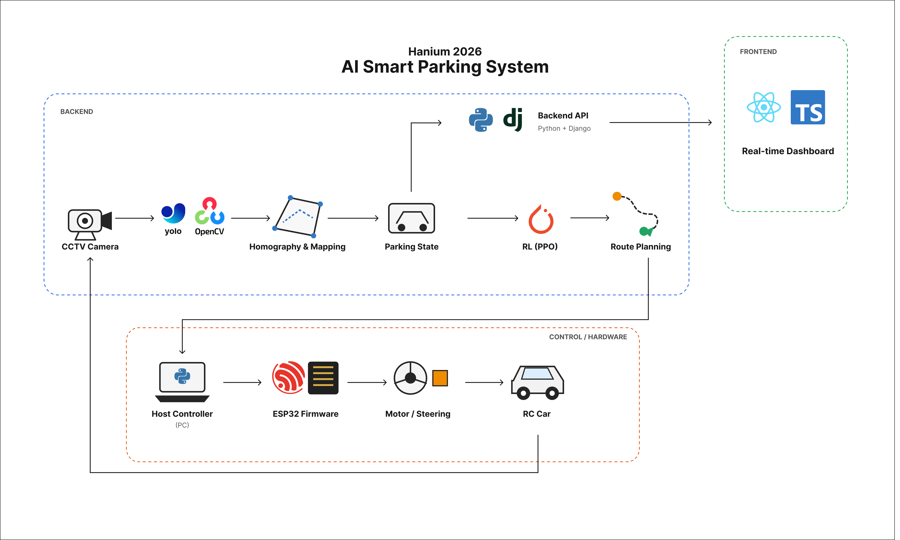

# 🚗 Hanium 2026 — AI Smart Parking System

CCTV 기반 차량 인식과 강화학습 기반 주차 공간 배정,
RC Car 자동주차 제어를 통합한 AI 스마트 주차 시스템입니다.

## System Architecture

  

## Repositories

| Repository | Role |
|---|---|
| [Frontend](https://github.com/hanium-2026-project/frontend) | 실시간 주차 현황 및 시스템 상태 대시보드 |
| [Backend](https://github.com/hanium-2026-project/backend) | Perception, RL Decision Making, System Orchestration |
| [Hardware](https://github.com/hanium-2026-project/hardware) | Host Controller, ESP32 Firmware, RC Car Control |

## Engineering

실제 시스템 구축 과정에서 발생한 Perception, RL,
Vehicle Control 및 System Integration 문제를 분석하고 해결했습니다.

→ [Engineering Challenges & Problem Solving](https://github.com/hanium-2026-project/backend/blob/main/docs/engineering-challenges.md)
